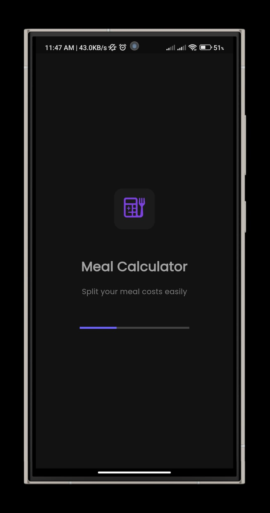
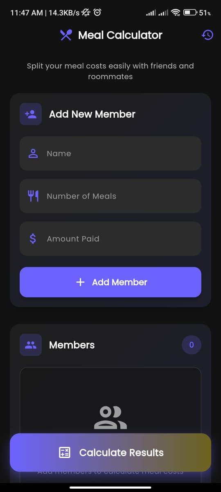
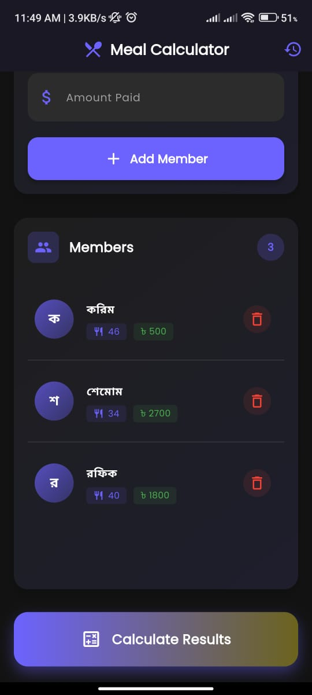
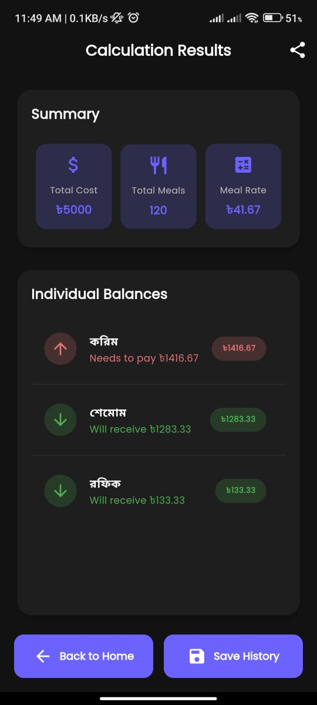
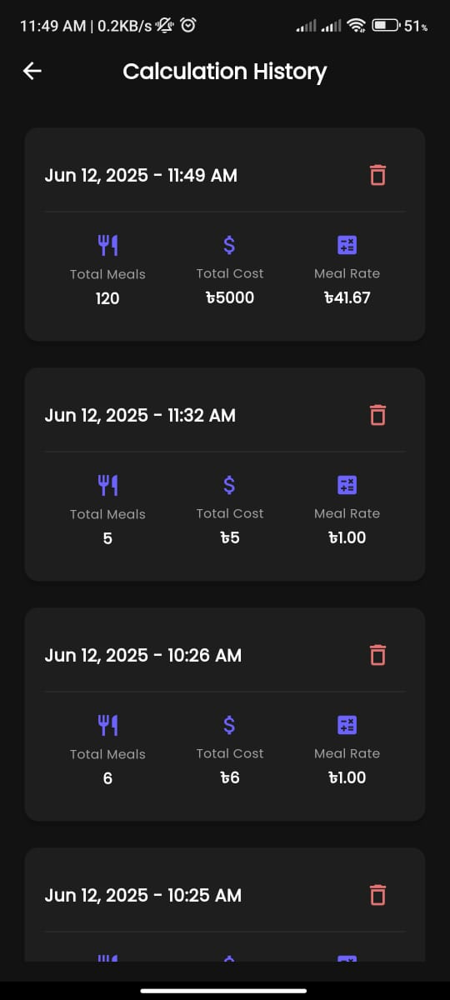

# Meal Calculator

A Flutter application for tracking meals and calculating meal-related data.

This repository contains a mobile app built with Flutter. The app uses
GetX for state management, local persistence with sqflite, and supports
responsive layouts via flutter_screenutil.

## Features

- Track meals and their details
- Local persistence using SQLite (sqflite)
- Responsive UI with `flutter_screenutil`
- Uses `get` (GetX) for dependency injection and routing
- Integrates Google Mobile Ads and sharing features

## Tech stack

- Flutter (Dart)
- get (GetX)
- sqflite
- shared_preferences
- flutter_screenutil
- google_mobile_ads
- google_fonts

## Prerequisites

- Flutter SDK (matching the project's SDK constraint: >=3.4.3 <4.0.0)
- Android Studio or Xcode (for building to devices/emulators)
- A connected device or emulator

If you don't have Flutter installed, follow the official guide:
https://docs.flutter.dev/get-started/install

## Quick setup

1. Clone the repository

2. Install dependencies

	 flutter pub get

3. (Optional) If you want to run on Android, ensure an Android SDK and device/emulator are available.

4. Run the app

	 flutter run

The app's entrypoint is `lib/main.dart` which initializes the database
controller and shows `SplashScreen` as the first screen.

## Project structure (high level)

- lib/
	- main.dart              # App entrypoint and theme
	- controllers/           # GetX controllers (e.g. DbController, MealController)
	- models/                # Data models (e.g. meal_model.dart)
	- screens/               # UI screens (e.g. splash_screen.dart)
	- components/            # Reusable UI components
	- services/              # Platform or external services wrappers
	- helpers/               # Color, spacing and other helpers

## Important files & configuration

- `pubspec.yaml` — dependency list and assets. App assets are under `assets/images/` and the launcher icon is set to `assets/images/logo.png`.
- Android signing: `android/app/upload-keystore.jks` and `android/key.properties` are present — do not upload these files to public repos if they contain real credentials. Replace or secure them for production.
- Google Mobile Ads: `google_mobile_ads` is in dependencies. You must add your own ad unit IDs and initialize the SDK per Google's docs before releasing to production.

## Database

The app uses `sqflite` for local storage. The database controller is registered in
`main.dart` using `Get.put(DbController())`. See `lib/controllers/db_controller.dart` for schema and migration details.

## App screenshots

Below are a few screenshots from the app. Paths are relative to the repository root so these will render on GitHub and local viewers.

	
	
	
	
	

If the images don't display on your platform, ensure the `assets/app_screenshots` folder is present and that the files listed above exist.

